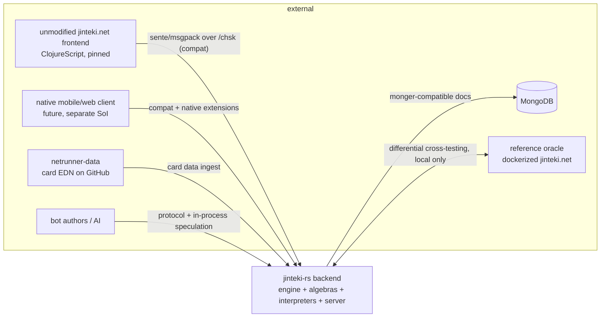

# jinteki-rs — DESIGN

**System of Interest:** a Rust rules engine + game server for Android: Netrunner, wire-compatible with jinteki.net, built final-tagless.

| | |
|---|---|
| Version | 0.2.0 — Amendment 1 (rules-conformance pivot) |
| Date | 2026-08-02 |
| Author | cognivore <jm@memorici.de>, drafted with Claude |
| **Rules baseline (normative)** | NSG *Netrunner Comprehensive Rules* **v26.03**, reproduced in `docs/rules/` |
| Wire baseline (compatibility) | `jinteki-reference` @ `40547303934e95aa9db4406f4d922bc48dca10bf` (2026-07-31) |
| License | WTFPL |

**Amendment 1 — 2026-08-02 — the conformance baseline splits in two.** Version 0.1.0 had ONE baseline: jinteki.net as-implemented, bugs included (old SYS-F-1). That is the correct target for the **wire** — the unmodified frontend must not be able to tell the difference — and the wrong target for the **rules**, because it caps our correctness at another implementation's defects and makes "complete and faithful" unmeasurable. This amendment splits the baseline:

- **Rules:** the Comprehensive Rules are the specification. They are authored, versioned, and *numbered*, so every engine primitive can cite the rule it implements and every conformance claim is auditable (SYS-F-1, SYS-F-9, SYS-F-10, DP-7).
- **Wire:** the pinned reference remains the compatibility baseline for the protocol, the ICD (Appendix B), and the persistence shapes. Unchanged.
- **Cards:** behavior is derived from printed oracle text, never from another implementation's source (SYS-D-10, SYS-D-11).
- **Consequence for DP-4:** jinteki.net is demoted from *definition* to *diagnostic oracle*. Where the two disagree, the CR decides, and the disagreement is recorded as an upstream defect rather than as our allowlisted divergence.
- **Added scope:** player identity, deck storage, a public decklist library, and NetrunnerDB import (§5.7) — a game nobody can bring a deck to is a tech demo.

**INCOSE conformance note.** This document tailors the INCOSE Systems Engineering Handbook (5th ed.) technical processes: Stakeholder Needs & Requirements Definition (§1–§4), System Requirements Definition (§5), Verification & Validation planning (§6), traceability (§7), risk & open-items register (§8), and a mandated project plan (§9). Requirement statements follow the INCOSE Guide to Writing Requirements: each has a unique ID, a singular **shall** statement, rationale, trace, and a verification method — **T**est, **D**emonstration, **A**nalysis, **I**nspection, plus **CT** for compile-time negative tests, which is a method this project gets to add because the type system is one of our verification instruments. Architecture ("how") lives in Appendix A and ONLY where we are already sure; everything else is a documented open item in §8. That is deliberate — this document mandates a plan and a contract, not an implementation.

All file references like `src/clj/game/core/diffs.clj:137` point into the reference repo at the pinned commit above.

---

## 1. Need, mission, measures

**NEED-1.** Make netrunner modern and attractive by enabling people to play games of netrunner faster.

One need, stated once, and everything below traces to it. "Faster" decomposes honestly into four things — faster to *start* playing (mobile, matchmaking, bots when no human is around), faster to *finish* a game (optional fuse clock, snappy client, no waiting on "is this legal?" round-trips), faster to *trust* the result (no leaks, no desyncs, replays you can share), and faster to *grow* the game (a designer ships a new card without begging a programmer). The current jinteki.net is a marvel — 61,810 lines of Clojure engine, 3,731 tests, a decade of accumulated rules knowledge — and we are NOT throwing that away. We are rebuilding the backend so that a hot mobile client becomes buildable on top of it, and we keep the old frontend working the entire time as our living conformance oracle.

**Measures of effectiveness.** Baselines collected in P0 (TBC-0); targets are directions until baselines exist, then they become numbers.

| ID | Measure | Direction |
|---|---|---|
| MOE-1 | Median wall-clock of a completed game | ↓ |
| MOE-2 | Time from app-open to first game action | ↓ |
| MOE-3 | Fraction of decisions waiting >5 s on "what can I even do?" | ↓ |
| MOE-4 | Games per player per week (attractiveness proxy) | ↑ |
| MOE-5 | Designer lead time: card idea → playtestable | ↓ |

## 2. System of Interest and boundary

The SoI is the **backend**: rules engine, card system, lobby, wire protocol, persistence. The mobile/web client is a *separate future SoI* — this document only guarantees the client will have what it needs (I-10, I-11). Please resist the temptation to smuggle client work into this repo; that boundary is load-bearing.



External systems: the pinned frontend (conformance client), the future native client, `NoahTheDuke/netrunner-data` (card data source — NOT the NetrunnerDB REST API; see `src/clj/tasks/nrdb.clj:23-25`), MongoDB (operators keep their data), the dockerized reference server (test oracle, local ONLY), and bots.

Out of scope, with evidence: angel-arena (`web.angel-arena` is never loaded — `web/system.clj:67,87` keep it commented out; dead upstream, dead here), and the exotic formats (quick-draft, turmoil, chimera, preconstructed) which are phase-tagged to P4 in the scope register (C-5).

## 3. Operational concepts

Seven scenarios. Each one is a full walk-through we replay in verification; they are the "what does done look like" of this project.

1. **OPS-1 Drop-in.** An operator points the unmodified jinteki.net frontend at jinteki-rs. Two players log in with their existing accounts, create a lobby, pick decks, play a complete game — runs, ice, psi games, traces, damage, win by agenda points — spectators watching, chat flowing, stats recorded. Zero client errors, zero visible difference.
2. **OPS-2 Native quick match.** A player on a phone opens the native client, gets a game, plays it with a per-turn fuse clock burning. Connection drops in a tunnel; they reopen and resume mid-run.
3. **OPS-3 Designer ships a card.** A game designer with no Rust knowledge writes a new card in the card DSL, the validator explains their two mistakes in card language, the sandbox lets them play it, differential fixtures run, the card ships in a data release.
4. **OPS-4 Replay.** A player loads a shared replay, steps forward and backward, jumps to turn 6. The replay interpreter reproduces the game from the log alone — no RNG, no clock, no database.
5. **OPS-5 Bot / are-you-sure.** A bot plays via the speculative interpreter: forks the state a few thousand times, samples opponents' hidden cards from what is *publicly consistent* — never from the truth. The same machinery powers "are you sure?" prompts for humans about to do nothing with a click.
6. **OPS-6 Cross-test run.** CI drives the same scripted game into jinteki-rs and into the dockerized reference at the pin, compares every client-visible byte, and files divergences against the allowlist. Gently: the oracle is local; production jinteki.net is NEVER load-tested.
7. **OPS-7 Spectation & redaction corners.** A spectator watches with `:spectatorhands` off and sees both players' public halves; a side-locked spectator sees the Corp's hand; mid-run accesses, psi bets, and `view-deck` reveal exactly what the rules say and nothing else.

## 4. Stakeholders and stakeholder requirements

| ID | Stakeholder | Requirement (shall) | Trace |
|---|---|---|---|
| STK-1 | Players | Players shall be able to complete games in less wall-clock time than on the reference platform, with no reduction in rules fidelity. | NEED-1 |
| STK-2 | Mobile players | Players shall be able to play a complete game from a mobile device, surviving disconnects and app suspends. | NEED-1 |
| STK-3 | Game designers | A designer without programming skills shall be able to encode a new card unaided. | NEED-1 |
| STK-4 | Operators & community | Operators shall be able to adopt jinteki-rs without a flag-day: existing frontend, existing accounts, existing decks and stats keep working. | NEED-1 |
| STK-5 | Bot authors & researchers | Bot authors shall be able to drive games programmatically and run forked, determinized simulations that structurally cannot cheat. | NEED-1 |
| STK-6 | Engine maintainers | Maintainers shall be able to change engine internals with confidence bounded by tests and types, not tribal knowledge. | NEED-1 |
| STK-7 | Spectators & creators | Spectators shall get shareable replays and an event feed rich enough to drive animation. | NEED-1 |
| STK-8 | Everyone | Hidden information shall never reach a party not entitled to it. | NEED-1 |

## 5. System requirements

Grouped: **I** interfaces, **F** functional, **D** data & card DSL, **Q** quality, **S** information safety, **C** constraints. Format per requirement: statement · rationale · trace · verification. Phase tags refer to §9.

### 5.1 Interface requirements (the drop-in contract)

The reference frontend is the conformance client. If it works unmodified, we are compatible; if it doesn't, we are not — no partial credit. The precise wire contract is Appendix B (ICD), generated from the pinned commit; these requirements bind the SoI to it.

**SYS-I-1 (P0–P2).** When operating in compat mode, the SoI shall support the unmodified reference frontend at the pinned commit through all OPS-1 flows with zero client-side errors.
*Rationale:* drop-in is the migration story (STK-4); the frontend is the executable definition of "compatible." *Verify:* D + T (headless-browser OPS-1 runs; golden transcripts).

**SYS-I-2 (P0–P2).** The SoI shall accept every client→server WebSocket event and emit every server→client event enumerated in ICD §B.3–B.4, with observational equivalence to the reference as defined by DP-4.
*Rationale:* the event catalog is exhaustive in the ICD precisely so "supports the protocol" is checkable, not vibes. *Verify:* T.

**SYS-I-3 (P0).** The SoI shall implement the sente-compatible session layer per ICD §B.1: `/chsk` GET (WebSocket) and POST (AJAX fallback), MessagePack packer including msgpack extension type 100 (`LocalDateTime` as UTF-8 ISO string), CSRF token flow, and the uid model (username when logged in, client-id otherwise).
*Rationale:* wire format is MessagePack, NOT transit — a wrong guess here fails the handshake before anything else can be tested (`web/ws.clj:29`, `jinteki/msgpack_ext.cljc:10-17`). *Verify:* T.

**SYS-I-4 (P0–P1).** The SoI shall encode game-state payloads per ICD §B.7: full states and diffs as JSON strings inside msgpack events; diffs as differ-compatible `[insertions, deletions]` pairs including the `"+"` vector-append sentinel; the `:sequence` counter incremented on state diffs and NOT on chat-only diffs.
*Rationale:* the client patches with `differ/patch` and resyncs when sequence numbers skip — get the bump rules wrong and every client resync-loops (`game/core/diffs.clj:595,623-632`, `nr/gameboard/state.cljs:16-26`). *Verify:* T.

**SYS-I-5 (P0–P2).** The SoI shall implement the `:game/action` command table per ICD §B.5 — all 47 commands — including the `aid` lock protocol (bump per accepted command) and silent-ignore of unknown commands.
*Rationale:* the command table (`game/core/process_actions.clj:67-114`) is the entire in-game verb set of the compat client, and the aid counter is its concurrency control. *Verify:* T.

**SYS-I-6 (P1).** The SoI shall serve the REST surface per ICD §B.2 with matching methods, paths, status codes, responses, ETag caching on `/data/cards*`, and the `/game/*` external API with `X-JNet-API` key auth.
*Rationale:* the SPA boots from `/data/*`; third-party tools use the documented Game API (`docs/jinteki-GameAPI-1.0.0.yaml`). *Verify:* T.

**SYS-I-7 (P1).** The SoI shall authenticate per ICD §B.10: verify existing bcrypt password hashes, issue and validate HS512 JWT session cookies with the reference claim set, and preserve the register/login/logout/forgot/reset flows with matching status codes.
*Rationale:* "existing accounts keep working" (STK-4) is literal — same `users` collection, same hashes, same cookie. *Verify:* T.

**SYS-I-8 (P1 read-critical; P4 full).** The SoI shall read and write MongoDB collections and document shapes per ICD §B.12, such that the reference server and jinteki-rs can be pointed at the same database.
*Rationale:* migration is an operator flipping a process, not an ETL project. *Verify:* T (round-trip against a database seeded by the reference).

**SYS-I-9 (P2).** The SoI shall record and serve replays per ICD §B.9: per-action history diffs, the `generate-replay` JSON shape, `game-logs` storage with sharing/retention/bug-report semantics, and replay-restore into a live lobby.
*Rationale:* replay playback is 100% client-side over the diff log — the format IS the feature (STK-7). *Verify:* T.

**SYS-I-10 (P3).** When operating in native mode, the SoI shall expose an additive protocol extension in which every state change is delivered as a causally-attributed, totally-ordered event (cause card, acting player, ordering key), sufficient to drive client animation without state-diff archaeology.
*Rationale:* the compat diff stream says *what* changed, never *why* — animation needs why (STK-7); the native client needs this to feel alive. Additive means compat clients are untouched. *Verify:* I + D.

**SYS-I-11 (P3).** When operating in native mode, the SoI shall enforce an optional server-authoritative per-turn clock (fuse) with defined expiry behavior; in compat mode the SoI shall NOT enforce any clock and shall reproduce reference timer behavior exactly: echo the cosmetic `:timer` option, emit `:game/timeout-soon` / `:game/timeout` on inactivity, and expose `:round-end-time` for competitive rooms.
*Rationale:* verified finding — the reference `:timer` is client-side decoration ("the game will not stop when timer runs out", `nr/new_game.cljs:219`); the only real timeouts are inactivity sweeps (`web/lobby.clj:852-875`). The fuse is therefore a genuinely new feature and MUST NOT leak into compat mode. *Verify:* T.

### 5.2 Functional requirements (the engine)

**SYS-F-1 (P1→, REVISED by Amendment 1).** The SoI shall implement the game rules as specified by the NSG *Netrunner Comprehensive Rules* v26.03 (the "CR"), reproduced normatively in `docs/rules/`. Where observed jinteki.net behavior contradicts the CR, the CR governs, and the difference shall be recorded in the divergence ledger as an upstream defect — not as a deviation of ours.
*Rationale:* v0.1.0 targeted parity-with-jnet-as-implemented because the frontend is calibrated to it. That reasoning holds for the wire and fails for the rules: it makes another implementation's bugs our ceiling and leaves "faithful" undefined. The CR is numbered and citable, so conformance becomes a property we can trace and test rule by rule. *Verify:* T (DP-7) + I (ledger).

**SYS-F-2 (P2).** For any reachable state and viewpoint, the SoI shall enumerate exactly the set of commands (with targets) that the executor would accept — sound and complete per DP-3 — and shall expose, per action, what it requires, what it targets, and whether it is currently satisfiable.
*Rationale:* interpret an action not as a state transition but as a constraint set. This kills MOE-3 (no "try it and get a toast" round-trips), powers UI affordances, and the reference already gropes toward it with the `:change-in-game-state` guard (`engine.clj:336-345`) — we promote the grope to a semantics. *Verify:* T (property: enumerator ⇔ executor).

**SYS-F-3 (P1→).** Every disclosure of hidden information shall flow through the Reveal/Query algebras; no other code path shall read hidden zones for output.
*Rationale:* if redaction lives in ad-hoc serialisation code you will leak information eventually; if it's an interpreter, the type system is the thing preventing the leak (STK-8). *Verify:* I + DP-5.

**SYS-F-4 (P1).** The SoI shall reproduce a game's full state stream from its event log alone (DP-2); the replay interpreter shall require no RNG, no wall clock, no network, and no database.
*Rationale:* in the replay interpreter, `shuffle` does a different thing than in prod — it replays the recorded permutation. That is the whole point of interpreters. *Verify:* T.

**SYS-F-5 (P3).** The speculative interpreter shall fork game state cheaply via structural sharing, sustaining ≥10,000 forks/second/core on a representative mid-game state (TBC-1).
*Rationale:* MCTS and are-you-sure both die without cheap forking (STK-5). *Verify:* T (benchmark).

**SYS-F-6 (P3).** The speculative interpreter shall resample hidden zones only from distributions consistent with the querying player's public knowledge, and shall have no API through which ground-truth hidden state is reachable.
*Rationale:* "opponent's hand" must mean *a sample from the space consistent with public knowledge*, not the actual hand — structurally impossible to cheat, not audited-to-not-cheat. *Verify:* CT (compile-fail tests) + A.

**SYS-F-7 (P3).** The SoI shall expose a query classifying a legal action as likely-inconsequential (no game-state change, dominated, or forfeiting a resource), suitable for client "are you sure?" confirmation prompts.
*Rationale:* faster games include fewer misclicks litigated in chat. *Verify:* D.

**SYS-F-8 (P1).** The test interpreter shall provide seeded randomness, `stack-deck` semantics, and injectable access-order functions reproducing the reference test-harness determinism model.
*Rationale:* the reference corpus is deterministic by *content*, not order — decks genuinely shuffle; only 12 `stack-deck` sites and the `:hq-access-fn`/`:rd-access-fn` indirections (`player.clj:134-135`) are order-load-bearing. Reproduce those hooks and the 3,731-test corpus ports. *Verify:* T.

**SYS-F-9 (P1.5, NEW — Amendment 1).** The SoI shall implement a rules virtual machine whose primitives correspond to the CR's own constructs: the checkpoint procedure (§10.3), the ability taxonomy and resolution model (§9.4–§9.10), priority and paid-ability windows (§9.2, §9.5), and the timing structures of the Corp turn, Runner turn, run, breach, and access (§11.2–§11.6) represented as ordered, data-driven step tables rather than control flow.
*Rationale:* the CR is already a virtual-machine specification — it defines states, an instruction set, an event loop, and an ordering discipline, down to lettered sub-steps. Implementing it *as such* makes conformance checkable step by step and makes new cards configuration rather than special cases. Implementing it ad hoc is how the reference ended up with two coexisting event pipelines (R-6). *Verify:* I (structure) + T (DP-7).

**SYS-F-10 (P1.5, NEW — Amendment 1).** Every VM primitive, timing step, and ability-resolution branch shall cite the CR rule id it implements, and a traceability test shall assert that every cited id exists in the extracted rule index.
*Rationale:* a conformance claim that cannot be traced is a claim of vibes. Citations make the engine auditable against a numbered document and turn a CR version bump into a diff instead of an archaeology project. *Verify:* T + A.

**SYS-F-11 (P1.5, NEW — Amendment 1).** The SoI shall model the CR's interrupt and replacement-effect layer (§9.9) as a first-class resolution stage, not as special cases inside individual abilities.
*Rationale:* replacement effects ("instead of", prevent/avoid, run redirection) are where ad-hoc engines break irrecoverably, because they must intercept resolution that has already begun. Modeling them once, where the CR puts them, is the difference between implementing 2,000 cards and fighting them. *Verify:* I + T.

### 5.3 Data & card DSL requirements

Here is the empirical situation, and it is the strongest argument in this document. The reference DSL looks declarative but measures imperative: across 2,056 cards, `:effect` (raw code) appears 2,821 times, `:async true` — pure sequencing ceremony — 2,226 times, and hand-written `:msg` log lines 2,034 times, roughly one per `:req`. A third of card authoring is writing prose the engine should derive, and another chunk is bookkeeping the engine should own. Meanwhile the genuinely reusable layer — ~100 helper constructors like `wall-ice`, `gain-credits-ability`, `end-the-run` — is where cards read like cards: `(defcard "Ice Wall" (wall-ice [end-the-run]))`. The new DSL's job is to make THAT the whole language, with real semantics underneath instead of ceremony.

**SYS-D-1 (P1→).** Standard-pattern cards shall be expressible as pure data in the card DSL, with no general-purpose code.
*Rationale:* cards are content, not software; data can be linted, diffed, translated, and written by non-programmers (STK-3). *Verify:* A (corpus census).

**SYS-D-2 (P3 gate).** A recruited group of ≥4 card designers with no Rust experience shall, using only the DSL guide, each encode 2 novel medium-complexity cards within 45 minutes, with ≥3 of 4 succeeding and zero lines of Rust written.
*Rationale:* "EXTREMELY APPROACHABLE" gets a number or it gets forgotten. *Verify:* D (usability trial).

**SYS-D-3 (P2).** Every DSL validation error shall name the card, the offending field, and a suggested fix, in card-designer language; verified over a seeded-mistake corpus.
*Rationale:* error quality is the difference between self-serve and give-up. *Verify:* T.

**SYS-D-4 (P2→).** Cards requiring the Rust escape hatch shall be enumerable in a registry and shall not exceed 5% of the implemented pool (TBC-2).
*Rationale:* upstream ground truth: 69 raw `swap!` sites ≈ 3.4% of the pool (Ekomind installs a *watcher on the state atom*, `hardware.clj:895-902` — some cards are just like that). Budget the weirdness, don't deny it. *Verify:* A.

**SYS-D-5 (P1).** The SoI shall ingest card data from the same upstream pipeline as the reference — the `netrunner-data` EDN blob, including localized `cards-<lang>` sets — producing the same files and collections.
*Rationale:* one card database for both servers during migration (STK-4); i18n comes along for free. *Verify:* T.

**SYS-D-6 (P1→).** Every DSL construct shall denote into the engine algebras; the DSL shall have no direct state access.
*Rationale:* this is what makes one card text mean five things under five interpreters — the DSL compiles to the algebra, interpreters give it meaning. *Verify:* I.

**SYS-D-7 (P2).** The DSL shall derive default log lines (including viewpoint-dependent public/Corp/Runner variants) from the denoted semantics; hand-written text shall be needed only for flavor overrides.
*Rationale:* 2,034 hand-written `:msg` strings, each a chance to lie about what actually happened; upstream even has viewpoint-split messages (`engine.clj:320-322`) maintained by hand. Derive, don't transcribe. *Verify:* T.

**SYS-D-8 (P2).** Prompt results shall be typed; no DSL construct shall round-trip data through display strings.
*Rationale:* Khusyuk (`events.clj:2233-2235`) string-formats choices and *parses the chosen string back into numbers*. We do not do this. *Verify:* I.

**SYS-D-9 (P2).** The DSL shall represent printed-text errata and behavioral implementation gaps as distinct annotations.
*Rationale:* upstream mixes both into one `:implementation` key (56 uses); they have different audiences and lifecycles. *Verify:* I.

**SYS-D-10 (P1.5→, NEW — Amendment 1).** Card behavior shall be derived from the card's printed oracle text as published by NSG, and every implemented card shall carry, in-repo, the exact text it was implemented from.
*Rationale:* implementing from another implementation propagates that implementation's misreadings silently; implementing from text is auditable by any player holding the card. Storing the text next to the behavior turns "is this card right?" into a diff a human can win. *Verify:* T (text-vs-behavior review corpus) + A.

**SYS-D-11 (P2, NEW — Amendment 1).** The DSL's instruction vocabulary shall be derived from the CR's own instruction taxonomy (§9.11, "Identifying Instructions"), such that encoding a card is transcription of its printed text into VM instructions rather than reinterpretation of it.
*Rationale:* the CR already specifies how to *read* a card — where an instruction begins, what is a cost versus an effect, how conditionals scope. A DSL shaped like that taxonomy makes encoding mechanical, which is precisely what makes it approachable to a non-programmer designer (STK-3, SYS-D-2). *Verify:* A + the D-2 usability trial.

**SYS-D-12 (P1.5, NEW — Amendment 1).** No card shall be playable in a game unless its behavior is implemented; unimplemented cards shall remain visible and inspectable everywhere else (browser, deck builder, library) with explicit status.
*Rationale:* silent vanilla-fallback play is a correctness lie — the game looks legal and isn't. Visibility without playability is honest and keeps the coverage gap measurable. *Verify:* T.

### 5.7 Players, decks, and libraries (NEW — Amendment 1)

A rules engine nobody can bring a deck to is a tech demo. These requirements cover the smallest identity and deck subsystem that makes the thing a product, and they are deliberately password-free.

**SYS-I-12 (P2).** A player shall receive a durable pseudonymous identity on first visit with no registration step, sufficient to own decks and to resume games across refreshes, closed tabs, and devices-of-one.
*Rationale:* the fastest game is the one you didn't have to sign up for (NEED-1, MOE-2). *Verify:* T + D.

**SYS-I-13 (P2).** A player shall be able to upgrade a pseudonymous identity into an email-identified account via a single-use, expiring emailed link; the SoI shall never collect or store a password; and all content created while pseudonymous shall transfer to the claimed account.
*Rationale:* proven in the author's own `draftroom` and `north-london-cube-community`; passwordless removes the entire credential-breach class, and adoption-on-claim means nobody loses work by having started before signing in. *Verify:* T + I (threat model).

**SYS-I-14 (P2).** The SoI shall provide a public decklist library and per-player deck storage, with deck validation against CR §1.4 deck construction (identity, minimum deck size, influence, agenda points).
*Rationale:* players arrive with a deck in mind; a library makes the first game reachable in one tap (MOE-2). Validation belongs to the rules layer, not the UI. *Verify:* T.

**SYS-I-15 (P2).** The SoI shall import decklists from NetrunnerDB by URL or id, reporting per-card implementation status on import rather than failing opaquely.
*Rationale:* NRDB is where the community's decks already live; strict-mode play (SYS-D-12) is only tolerable if the deck builder tells you *which* cards are missing and why. *Verify:* T.

### 5.4 Quality requirements

**SYS-Q-1 (P1).** The engine core shall build and run with no dependency on network, disk, database, wall clock, or ambient RNG; time and entropy shall enter only through algebra interpreters.
*Rationale:* the reference already almost achieves this — `game.core.*` is pure atom mutation with exactly two `inst/now` leaks (game start, win). We finish the job, because sans-IO is what makes every interpreter in Appendix A.2 possible. *Verify:* I + A (dependency lint in CI).

**SYS-Q-2 (P1→).** The differential property suite DP-1…DP-6 and the CT suite shall run in CI as a merge gate.
*Rationale:* N interpreters is N implementations that must agree, and the agreement is not free — differential testing is the price of admission. Pay it on every merge. *Verify:* I.

**SYS-Q-3 (P1 baseline; targets TBC-3).** The SoI shall process an action to broadcast diff at p99 ≤ 50 ms with 500 concurrent games on 2 vCPUs, and replay at ≥10× real time.
*Rationale:* faster games need a server that never makes players wait; targets ratified against P1 measurements (the reference ships a `load-generator` task we can reuse for baselines). *Verify:* T (benchmark rig).

**SYS-Q-4 (all).** The SoI shall build on stable Rust with zero nightly feature gates.
*Rationale:* see Appendix C — the artifact that inspired this design needs seven nightly gates including a perma-unstable one; it is the boundary marker, not the destination. *Verify:* I (CI builds on stable).

**SYS-Q-5 (P1).** Given identical seed and action script, the SoI shall produce byte-identical event logs across runs and platforms (DP-6).
*Rationale:* determinism is the substrate of DP-2, DP-4, and every bug report that says "here's the seed." *Verify:* T.

**SYS-Q-6 (P1→).** The reference test corpus (3,731 kaocha tests) shall be transpilable into SoI acceptance fixtures via a maintained translator for the reference harness vocabulary; ported fixtures for implemented cards shall pass 100%, and the coverage counter shall be public.
*Rationale:* 80,093 lines of accumulated rules knowledge — the test suite is larger than the application — and its helper vocabulary is ~25 functions (`test_framework.clj`). Translating it buys a decade of edge cases for the cost of a compiler. *Verify:* T.

### 5.5 Information-safety requirements

**SYS-S-1 (P1→).** Per-viewpoint redaction shall be an interpreter of the query algebra, type-indexed by viewpoint, and shall be the ONLY serialization path to any client-bound payload.
*Rationale:* the reference centralizes this well (`game/core/diffs.clj` — `card-summary`, `private-card`, `public-states`) but enforces it by discipline; we enforce it by type. DP-5 fuzzes it; CT proves the unredacted state has no route to a socket. *Verify:* CT + T + I.

**SYS-S-2 (P2).** Compat-mode spectator semantics shall match the reference exactly — opponent-blind halves by default, both-full under `:spectatorhands`, side-locked spectators receiving that side's full private view — and the documented leak-adjacent behaviors (ICD §B.8 flags) shall each carry an explicit replicate-or-tighten decision; native mode may tighten.
*Rationale:* compat means compat, even where the reference is generous (side-locked spectate grants a full hand view gated only by lobby password — `diffs.clj:533-539`, `web/lobby.clj:877-887`); but we write the generosity down and decide it on purpose. *Verify:* T + I.

**SYS-S-3 (P2).** Replay artifacts shall contain only the replay viewpoint (`hist-state`), and replay sharing/visibility shall follow reference semantics.
*Rationale:* a replay is a broadcast; redaction applies to broadcasts (STK-8). *Verify:* T.

### 5.6 Constraints

**SYS-C-1.** Implementation language shall be Rust, stable toolchain. *Rationale:* the rewrite exists for prototyping velocity with a type system strong enough to carry the safety story; stable because infrastructure. *Verify:* I.

**SYS-C-2.** The SoI shall be licensed WTFPL. *Verify:* I.

**SYS-C-3.** Engine capabilities shall be partitioned into narrow algebras per Appendix A.1; no interpreter instance shall contain `unreachable!()`, `panic!()`, or equivalent on honest input. Presence of such is a defect of the algebra factoring, not of the interpreter, and CI shall lint for it.
*Rationale:* none of this works with a monolithic MonadCardGame. The pretty-printer has nothing sensible to say about `persistEvent`, and the legality checker has nothing sensible to say about `shuffle`. The moment you write "unreachable" in an instance, the algebra is wrong. *Verify:* I + A.

**SYS-C-4 (REVISED by Amendment 1).** *Rules* conformance shall be defined against the CR version named in the header, reproduced in-repo and regenerable when NSG publishes a new version; *wire* conformance shall be defined against the pinned reference commit, with a scheduled job regenerating the ICD against upstream master and reporting deltas. The cross-test oracle shall be a locally-hosted reference instance, and the SoI's test tooling shall NEVER direct load at production jinteki.net.
*Rationale:* "automatically and gently" — the reference repo ships its own docker-compose; we test against that, at home, like polite people. *Verify:* I.

**SYS-C-5.** The scope register shall phase-tag: angel-arena EXCLUDED (dead upstream), quick-draft/turmoil/chimera/preconstructed formats P4, admin/tournament/prizes event families P4 (stub-with-correct-shape earlier).
*Rationale:* drop-in for the game first; the long tail is real but not load-bearing for NEED-1. *Verify:* I.

Kepischt? Interfaces are a contract with a dead-exact ICD, the engine is parity-with-evidence, the DSL gets a usability number, and safety is a compile error. Now the tests that make it true.

## 6. Verification: the differential harness

Without these properties you don't have multiple interpreters of one algebra, you have several subtly different games sharing a type class. So the harness is a first-class deliverable — it comes up in P0, before most of the engine exists, and every phase gate cites it. Note what we inherit: the reference has ZERO property tests and ZERO wire-protocol tests (honest grep: no test.check, no sente coverage; only one serialization-contract test, `replay_restore_test.clj`). The entire differential layer below is net-new value.

| ID | Property | Statement | Backs |
|---|---|---|---|
| DP-1 | Pure ≍ production | Same action script through the in-memory interpreter stack and through the production stack (temp DB, loopback transport) yields observationally equal states — all viewpoint projections AND the full-knowledge projection. | Q-2 |
| DP-2 | Record/replay | Run production, capture the event log, replay through the replay interpreter: identical state stream. | F-4, I-9 |
| DP-3 | Legality coherence | Enumerator says yes ⇒ executor accepts; enumerator says no ⇒ executor rejects. Property-tested over generated states plus a corpus distilled from real games. | F-2 |
| DP-4 | Cross-implementation (REVISED) | Scripted games driven over the wire into jinteki-rs and the dockerized reference at the pin; client-visible streams compared modulo the divergence ledger. Protocol differences are OUR defects; rules differences are adjudicated against the CR, and whichever side contradicts it is the defect. | I-1..9, F-1 |
| DP-7a | CR worked examples (NEW) | EVERY example situation printed in the CR (~438 marked-up examples) is an executable regression test asserting the outcome the rules authors state. These are authored conformance cases — the specification's own test suite — and they are non-negotiable: the suite runs green or the engine is wrong. | F-1, F-9, F-11 |
| DP-7b | CR rule citations (NEW) | For each CR rule and timing step the VM cites, a test drives the engine through the situation that rule governs and asserts the specified outcome. Indexed by rule id; coverage against the extracted rule index is published as a number. | F-9, F-10 |
| DP-7c | Card-interaction regression (NEW) | The reference's card-interaction corpus (3,731 tests) ported as regression tests against OUR engine. A ported test that fails is triaged against the CR: our defect, or an upstream defect recorded in the divergence ledger — never silently skipped. | F-1, D-10, Q-6 |
| DP-5 | No-leak | For every emitted client payload: payload ⊆ viewpoint-permitted knowledge. Fuzzed across mid-run, mid-access, psi, traces, `view-deck`, spectators, reconnect resync. | F-3, S-1..3 |
| DP-6 | Seed determinism | (seed, script) ⇒ byte-identical logs, cross-platform. | Q-5 |
| CT | Negative compile tests | The speculative interpreter cannot name ground-truth hidden state; the client serializer cannot accept an unredacted state type. Committed as compile-fail tests. | F-6, S-1 |

Verification methods roll-up: every SYS requirement above carries its method; the traceability table (§7) closes the loop. Validation (are we building the right thing) rides on the MOE baselines (TBC-0) and the OPS walkthroughs, re-demonstrated at each phase gate.

## 7. Traceability

NEED-1 → STK-1..8 → SYS → verification. Compact matrix; full per-requirement traces are inline in §5.

| STK | Satisfied by | Verified by |
|---|---|---|
| STK-1 faster games | F-2, F-7, I-11, Q-3 | DP-3, T-bench, D |
| STK-2 mobile | I-10, I-11, (native client SoI) | D |
| STK-3 designers | D-1..D-9 | D-2 trial, T, A |
| STK-4 no flag-day | I-1..I-9, D-5, C-4, C-5 | DP-4, T |
| STK-5 bots | F-5, F-6, I-2 | T-bench, CT |
| STK-6 maintainers | Q-1..Q-6, C-3 | DP-1..6, I |
| STK-7 spectators/creators | I-9, I-10, S-3 | T, D |
| STK-8 no leaks | F-3, S-1..S-3 | DP-5, CT |

## 8. Risks and open items

Risk register — the honest kind, with mitigations that are line items in §9, not thoughts and prayers.

1. **R-1 Upstream drift.** The pin ages; jinteki.net moves. *Mitigation:* C-4 scheduled ICD delta job; re-pin deliberately per phase.
2. **R-2 Bit-compat edge cases.** msgpack ext-100, JSON-inside-msgpack, differ `"+"` sentinel, float/int encodings, `:sequence` bump rules. *Mitigation:* golden transcripts captured in P0 before any engine work; DP-4 byte-wise.
3. **R-3 Parity vs. bugs.** The reference has rule bugs; matching them feels dirty, fixing them breaks parity. *Mitigation:* F-1 allowlist with upstream issue links — every divergence is a documented decision.
4. **R-4 DSL expressiveness ceiling.** The verb set may not cover the tail. *Mitigation:* D-4 escape hatch with a budget; vocabulary designed from the measured key-frequency census, not intuition.
5. **R-5 Scope creep into the client.** *Mitigation:* §2 boundary; I-10/I-11 are the only client-facing promises here.
6. **R-6 Ordering edge cases.** Upstream has TWO coexisting event pipelines (modern queue+checkpoint per CR 10.3, plus legacy `trigger-event*` paths) — parity is observational, and the observations are subtle. *Mitigation:* Q-6 fixture corpus + DP-4 fuzz scripts aimed at trigger-ordering windows.
7. **R-7 Recompute-everything performance.** The reference recomputes derived values up to 10 passes after every action (`fake-checkpoint`) and memoizes nothing. A naive port inherits the cost. *Mitigation:* parity first, measure (Q-3 baseline), incrementalize behind the same observable behavior.

Open items (TBC/TBD register, each with an owner-phase and closure criterion):

| ID | Item | Closes at |
|---|---|---|
| TBC-0 | MOE baselines measured on reference | P0 exit |
| TBC-1 | Fork-rate target ratified (F-5) | P3 gate |
| TBC-2 | Escape-hatch ratio ratified (D-4) | after 500 cards ported |
| TBC-3 | Perf targets ratified (Q-3) | P1 gate |
| TBC-4 | Effect-sequencing mechanism: `async`/`await` over a custom executor vs. defunctionalized continuation stack vs. explicit state-machine. Decision criteria: DP-2 determinism, F-5 fork cost, DSL-compiler ergonomics. The reference uses CPS over a mutable atom with one-shot continuations (`eid.clj:21-25`) — instructive, not binding. | P1, before card port begins |
| TBC-5 | DSL surface syntax frozen (candidate in A.3 is non-normative) | P2, after designer pilot |

## 9. The Plan (mandated)

Five phases. Each phase has a gate; a gate is a list of green things, and we do not argue with gates. Cross-testing exists from day one — the harness is not a "later" item, it IS the project's spine. Thank you.

**P0 — Protocol capture & walking skeleton.**
1. Stand up the reference via its own docker-compose at the pin; capture golden transcripts (handshake, lobby, full game, resync, spectate) — these become the DP-4 fixtures and the R-2 insurance.
2. Generate ICD §B from the pin (it is Appendix B of this document; the generator keeps it honest).
3. Card data ingest (D-5): `netrunner-data` → files + collections.
4. Walking skeleton: `/chsk` session layer (I-3), login against a reference-seeded user DB (I-7 partial), lobby list/create/join, and a degenerate game — click for credit, draw, take turns, concede — end-to-end from the unmodified frontend (I-1 smoke).
5. DP-4 rig runs in CI against the skeleton. MOE baselines collected (TBC-0).
*Gate:* OPS-1-smoke demo on skeleton; golden-transcript suite green; ICD generator reproducible.

**P1 — Engine core & the algebra cut.**
1. State model + turn structure + costs + prompts + event pipeline (single modern pipeline, observationally matching both upstream paths).
2. Algebras v1 per A.1 with prod/test/replay interpreters; TBC-4 decided; Q-1 sans-IO enforced by CI lint.
3. Runs, ice, breach/access minimal set; DP-1/2/3/6 green on the core; F-8 test interpreter with `stack-deck` + access-order hooks.
4. DSL v0 (data format + compiler to algebras) with ~20 canonical cards; Q-6 fixture transpiler translating the reference core-engine test set.
5. Full basic game via unmodified frontend (I-4, I-5 complete).
*Gate:* DP-1/2/3/6 in CI; ported core fixtures 100%; Q-3 baseline measured (TBC-3 ratified); demo: complete game with ice and breaches from the pinned frontend.

**P1.5 — The rules VM & the oracle-text card layer (NEW — Amendment 1).**
The playable milestone built in P0/P1 (local play vs bot, deployed, sessions) STAYS LIVE throughout: the VM is built alongside as its own crate and cards migrate onto it, then the old path is cut over and deleted. No flag day, no dark period.
1. Extract the CR into a normative in-repo reference with stable rule ids and machine-readable timing structures (`docs/rules/`), regenerable for future CR versions.
2. VM kernel: zones and objects (§1, §4), the checkpoint procedure (§10.3), ability taxonomy and resolution (§9.4–§9.10) including the interrupt/replacement stage (F-11), priority and paid-ability windows (§9.2, §9.5), costs (§1.16), and §11's timing structures as data-driven step tables (F-9). Every primitive cites its rule id (F-10).
3. Card layer: the CR §9.11 instruction taxonomy becomes the DSL vocabulary (D-11); cards are transcribed from printed oracle text and carry that text (D-10). Migrate the existing implemented pool onto the VM; strict play enforced (D-12).
4. **The verification ladder, climbed in this order — each rung green before the next is attempted:**
   a. **DP-7a — the CR's own examples.** Every worked example in the document becomes an executable test. These are authored by the rules authors and adjudicate themselves; they are the first and hardest gate on the VM.
   b. **DP-7b — rule citations.** Every VM primitive's cited rule gets a test; coverage published.
   c. **DP-7c — the card-interaction corpus.** The reference's 3,731 tests ported and run against our engine. Failures are triaged against the CR: ours to fix, or an upstream defect filed in the ledger. Nothing is skipped silently.
   d. DP-1/2/3/6 re-greened on the VM; DP-4 re-run with rules disagreements adjudicated per the revised SYS-F-1.
5. Identity, decks, library, NRDB import (§5.7) so real decks can be brought to the real rules.
6. **Then, and only then, the priority decks** (`tools/priority-decks.json`): estrike Andromeda and Gauntlet first, each card transcribed from oracle text onto the verified VM.
*Gate:* DP-7a 100% green; DP-7b covering 100% of cited rules with a published coverage number; DP-7c ported with every failure either fixed or filed; the priority decks legal, loadable, and playable end-to-end under strict mode; old engine path deleted, not merely bypassed.

**P2 — Card pool & the safety interpreters.**
1. Standard-format pool through the DSL (D-1..D-9), escape-hatch registry live (D-4).
2. Legality/enumeration interpreter shipping F-2, wired to are-you-sure plumbing (F-7 groundwork).
3. Redaction interpreter replaces any interim stripping (S-1..S-3); DP-5 fuzz + CT suite green.
4. Replays end-to-end (I-9); REST surface complete (I-6).
*Gate:* 100% Standard pool implemented with ported fixtures 100% green; DP-4 full-game suite green across a scripted tournament of games; DP-5 fuzz clean for 10⁶ payloads; OPS-4 + OPS-7 demos.

**P3 — Speculation, fuse, designers.**
1. Speculative interpreter: forking (F-5, TBC-1) + determinization (F-6, CT-enforced); baseline MCTS bot plays legal, non-embarrassing netrunner (OPS-5).
2. Native-mode protocol extension (I-10) + fuse clock (I-11).
3. Designer tooling: lint (D-3), sandbox, guide; run the D-2 usability trial; freeze DSL surface (TBC-5).
*Gate:* D-2 passed (≥3/4 designers); F-5 bench ≥ target; OPS-2 demo on a prototype native client shell; fuse provably absent in compat mode (DP-4 unchanged).

**P4 — Migration & scale.**
1. Full DB parity (I-8), admin/tournament/prizes families (C-5), inactivity/ops behaviors complete.
2. Perf hardening to Q-3 targets; soak: 72h continuous cross-test churn.
3. Operator runbook + migration dry-run: same Mongo, reference and jinteki-rs side by side, cutover and cut back.
*Gate:* OPS-1 full (not smoke) on a production-shaped deployment; soak clean; migration dry-run documented and reversible.

The native mobile client then begins as its own SoI with its own design document, standing on I-10/I-11 — and inherits a backend that five interpreters, six differential properties, and one grumpy allowlist have been beating on since P0. Go nuts. Godspeed!

---

## Appendix A — Architecture mandates (normative where marked)

Only what we are already sure of. Everything else is TBC and says so.

### A.1 Narrow algebras (criterion NORMATIVE; catalog PROVISIONAL)

The law, restated as the design's first principle: narrow algebras — each interpreter implements the slice it can honestly denote. `MonadCardGame` the god-trait is FORBIDDEN. The forcing function (normative, and it has teeth in CI via C-3):

1. An algebra earns existence only when ≥2 interpreters denote it honestly.
2. `unreachable!()` in an instance is a factoring defect. Fix the algebra, not the interpreter.
3. An algebra outgrowing ~7 operations is a smell; split it.

Starter catalog — PROVISIONAL, to be discovered by porting cards, and the reference already whispers the seams to us:

| Algebra | Operations (sketch) | Upstream precedent |
|---|---|---|
| `Deck` | shuffle, draw, peek, insert-at, mill, stack | `:hq-access-fn`/`:rd-access-fn` stored *in state* (`player.clj:134-135`) — access order is already a pluggable function upstream |
| `Rng` | entropy for Deck, d6, marks, random trash | upstream MIXES SecureRandom with plain `clojure.core/shuffle` across 20+ sites — one algebra makes that class of drift impossible |
| `Reveal` | reveal, expose, access-disclose | every disclosure event in `access.clj` |
| `Query` | viewpoint-indexed state observation | `diffs.clj` key-whitelists (`card-keys`, `private-card-keys`, `state-keys`) — the contract exists, we lift it to types |
| `Prompt` | ask(choices) → typed answer, select, waiting | ALL prompts flow through `show-prompt` (`prompts.clj:30-68`) already |
| `Priority` | consent latches, no-action, trigger windows | the reference has NO priority object — gating is prompt-lock + phase-1.2/post-discard consent + run no-action latches (§B.5 notes); the algebra denotes THAT, not MTG priority |
| `Clock` | now, deadlines, fuse | the two `inst/now` leaks (`set_up.clj:108`, `winning.clj:16`) become injections |
| `Persist` | append-event, snapshot, stat-inc | `:history` accumulation + `game-logs` writes (`web/game.clj:60`, `web/stats.clj:227-257`) |
| `Log` | emit(viewpoint-indexed line) | log entries are ALREADY `{:public}` / `{:corp :runner}` maps (`say.clj:64-88`) |

### A.2 Interpreter × algebra matrix (NORMATIVE intent; cells marked ∅ are ABSENT BY TYPE, not unimplemented)

The user-story of the whole architecture in one table — what does `shuffle` mean?

| | production | test | replay | legality | speculative | redacted-query |
|---|---|---|---|---|---|---|
| `Deck.shuffle` | fresh CSPRNG permutation | seeded PRNG; `stack-deck` override | recorded permutation from log; RNG does not exist here | constraint no-op: marks order unknown | resample from belief state consistent with public knowledge | ∅ — queries don't mutate |
| `Rng` | OS entropy | seed | ∅ — log is the oracle | ∅ | belief-state sampler | ∅ |
| `Prompt.ask` | ship to client, suspend | scripted answers | answers from log | enumerate the choice-space | policy/rollout answers | ∅ |
| `Clock.now` | wall clock | virtual time | timestamps from log | ∅ | virtual time | ∅ |
| `Persist.append` | Mongo + history | in-memory | read-only source | ∅ | ∅ — forks never persist | ∅ |
| `Reveal/Query` | full knowledge | full knowledge | full knowledge | satisfiability view | PUBLIC KNOWLEDGE ONLY — ground truth unreachable by type (CT) | viewpoint-filtered |

The speculative column is the safety story: the production interpreter knows the truth and mustn't use it for decisions; the speculative interpreter must decide and CANNOT know the truth. Two interpreters, one algebra, opposite epistemics — this is structurally impossible to get backwards, which is the point.

### A.3 Two-level DSL (structure NORMATIVE; syntax NON-NORMATIVE)

Cards are DATA. Initial encoding at the surface — serializable, diffable, lintable, translatable, designer-writable — folded exactly once by the card compiler into final-tagless calls against the algebras. Deep embedding at the front, shallow at the back; initial for data, final for behavior. The engine never interprets card *syntax* at runtime; it runs compiled denotations.

Normative properties: (1) standard patterns need zero host-language syntax; (2) all sequencing implicit — there is no `:async true`, and frankly the 2,226 occurrences of it upstream are ceremony bullshit the compiler must own; (3) prompt results typed (D-8); (4) log lines derived (D-7); (5) every construct denotes into A.1 algebras (D-6); (6) escape hatch = named Rust function behind the D-4 registry, never inline.

Candidate surface (NON-NORMATIVE — frozen at TBC-5, shown so the properties have a face):

```
card "Sure Gamble" {
  play { gain 9 credits }
}

card "Ice Wall" {
  advanceable
  strength +1 per advancement
  sub "End the run" { end-the-run }
}

card "Predictive Planogram" {
  play {
    choose {
      "Gain 3 [Credits]" => gain 3 credits
      "Draw 3 cards"     => draw 3
      if runner.tagged {
        "Gain 3 [Credits] and draw 3 cards" => { gain 3 credits; draw 3 }
      }
    }
  }
}
```

Compare upstream Sure Gamble: five lines, an `:async`, an `:effect`, a hand-written `:msg` that repeats the effect. The compiler derives "gain 9 [Credits]" from `gain 9 credits` because it *knows what the card does* — that is what a semantics is for.

### A.4 The differential harness (NORMATIVE)

1. **Oracle rig:** reference at the pin via its own docker-compose; a scripted sente/msgpack client drives both servers with identical scripts; byte-wise comparison of client-visible streams (DP-4); allowlist consulted last, never first.
2. **Fixture transpiler (Q-6):** source vocabulary is the ~25 helpers of `test_framework.clj` (`do-game`, `play-from-hand`, `run-continue-until`, `click-prompt`, `changed?` …) → target is our script format. Determinism per F-8. The 12 `stack-deck` sites and access-order hooks are the only order-sensitive surface.
3. **Property layer:** DP-1/2/3/5/6 as proptest suites; state generators seeded from real captured games, then mutated.
4. **CT suite:** compile-fail tests are checked-in artifacts, reviewed like code.
5. **No silent tolerance:** every DP-4 mismatch either fails CI or is an allowlist entry with an upstream issue link. There is no third state.

### A.5 Sans-IO core & crate shape (sans-IO NORMATIVE; crate list NON-NORMATIVE sketch)

Engine crates depend on: `core`, `alloc`, and nothing with a syscall in it. Transport, DB, clocks, entropy live in interpreter/server crates. CI enforces the dependency direction (Q-1). Illustrative shape, nothing more: `jinteki-state`, `jinteki-algebra`, `jinteki-cards` (DSL + compiler + card data), `jinteki-interp-{prod,test,replay,legal,spec}`, `jinteki-redact`, `jinteki-compat` (sente/msgpack/differ wire), `jinteki-server`, `jinteki-oracle-rig`.

## Appendix B — ICD: the wire contract (NORMATIVE, generated from the pin)

This is the compatibility bible, distilled from the reference at `4054730…`. The P0 generator re-derives it; on conflict, generated output + golden transcripts win over this prose. File:line anchors are the audit trail. No document upstream describes this protocol — the reference has zero protocol docs and zero protocol tests; this appendix is the first written contract for it.

### B.1 Transport & session

- HTTP: http-kit behavior; SPA + static from `resources/public`; pages listed in §B.2.
- WebSocket endpoint `/chsk`: GET = sente handshake/upgrade, POST = AJAX fallback (`web/api.clj:57-58`). Client may run in `:ajax` mode (`:disable-websockets`) — the fallback path is part of the contract.
- Packer: **MessagePack** (sente 1.22.0 packer), with msgpack **extension type 100** = `java.time.LocalDateTime` as UTF-8 ISO string (`src/cljc/jinteki/msgpack_ext.cljc:10-17`).
- Keepalive `:ws-kalive-ms 2500` both directions. Client `:wrap-recv-evs? false`.
- CSRF: token embedded as `<div id="sente-csrf-token" data-csrf-token=…>` (`web/pages.clj:35-37`); AJAX sends `X-CSRF-Token`. `/reset/:token` routes are deliberately CSRF-exempt.
- UID model: `(or session-uid client-id)` where `wrap-user` sets session uid = **username** (`web/ws.clj:31-33`, `web/auth.clj:68`). One connection per uid (sente semantics).
- Server outbound flow control: 500-slot queue drained every 40 ms (`web/ws.clj:49-76`) — internal, but explains latency under fan-out.

### B.2 REST surface

Pages (GET, CSRF-wrapped): `/`, `/chat`, `/cards`, `/deckbuilder`, `/play`, `/help`, `/account`, `/stats`, `/about`, `/tournament`, `/admin`, `/users`, `/prizes`.

| Method | Path | Notes |
|---|---|---|
| GET/POST | `/chsk` | session layer (§B.1) |
| GET | `/data/cards`, `/data/cards/altarts`, `/data/cards/lang/:lang` | cards ETag `"<frontend-version>-<cards-version>"`, `Cache-Control: no-cache`, 304 on match |
| GET | `/data/news`, `/data/sets`, `/data/mwl`, `/data/cycles`, `/data/donors`, `/data/language/:lang` | static data |
| GET/POST/PUT | `/data/decks`; DELETE `/data/decks/:id`; POST `/data/decks-bulk-delete` | deck CRUD |
| GET/POST/DELETE | `/data/api-keys[/:id]` | auth-required |
| GET | `/chat/config`, `/messages/:channel` | chat |
| POST | `/register`, `/login`, `/forgot`, `/logout` | §B.10 status codes |
| GET | `/check-username/:username`, `/check-email/:email` | availability |
| GET/POST | `/reset/:token` | CSRF-exempt |
| GET | `/replay/:gameid`, `/bug-report/:bugid` | render SPA with `data-replay-id` |
| GET | `/game/decklist` `/game/deck` `/game/hand` `/game/discard` `/game/log` | external Game API: CORS any-origin GET, header `X-JNet-API` = UUID key checked against `api-keys` + lobby `:api-access`; schema per `docs/jinteki-GameAPI-1.0.0.yaml` |
| PUT | `/profile`; GET/PUT `/profile/email` | account |
| GET | `/profile/history`, `/profile/history/:gameid`, `/profile/history/full/:gameid` | stats & replay fetch |
| GET | `/profile/history/annotations/*:gameid` (fetch/publish/delete), `/profile/history/(un)share/:gameid` | annotations ≤50k chars, sharing |
| DELETE | `/profile/stats/user`, `/profile/stats/deck/{id}` | stat clearing |
| GET | `/tournament-auth/:username`, `/prizes/:username` | TO-gated |
| POST/DELETE/GET/PUT | `/admin/news[/:id]`, `/admin/version`, `/admin/banned` | admin |

### B.3 WS events, client → server

Sente internals: `:chsk/ws-ping`, `:chsk/ws-pong`, `:chsk/uidport-open` (registers user), `:chsk/uidport-close` (leaves lobby). Unknown ids → reply `{:msg "Unhandled event"}`.

- **Lobby** (`web/lobby.clj`): `:lobby/create` (full options map, §B.11), `:lobby/list`, `:lobby/block-game-creation`, `:lobby/leave {:gameid}`, `:lobby/deck {:gameid :deck-id}`, `:lobby/say {:gameid :text}`, `:lobby/join {:gameid :password? :request-side?}` (reply 200/403/404), `:lobby/swap {:gameid :side}` (host only), `:lobby/shift-game`, `:lobby/rename-game`, `:lobby/delete-game` (admin/TO), `:lobby/watch` (reply 200/403/404), `:lobby/pause-updates`, `:lobby/continue-updates` (list broadcasts go ONLY to subscribed uids; 1 h TTL).
- **Game** (`web/game.clj`): `:game/start {:gameid}`, `:game/leave`, `:game/rejoin` (server forces request-side "Any Side"; requires uid ∈ `:original-players` and <2 seated), `:game/concede`, `:game/action {:gameid :command :args}` (§B.5), `:game/resync`, `:game/watch`, `:game/mute-spectators`, `:game/say {:gameid :msg}`, `:game/typing {:gameid :typing}`.
- **Chat**: `:chat/say {:channel :msg}`, `:chat/delete-msg`, `:chat/delete-all` (mod).
- **Decks**: `:decks/import {:input}`.
- **Admin/Tournament/Prizes** (P4 per C-5): `:admin/announce`, `:admin/edit-user`, `:admin/look-up-ip`, `:admin/fetch-ip-bans`, `:admin/ip-ban-user`, `:admin/ip-unban-user`, `:admin/fetch-users`, `:admin/block-game-creation`; `:tournament/conclude-round`, `:tournament/declare-round`, `:tournament/view-tables`, `:tournament/announce`, `:tournament/update-tables`; `:prizes/load-user`, `:prizes/update-user`.
- **Angel-arena**: EXCLUDED — handlers exist in source but the namespace is never loaded (`web/system.clj:67,87`).

### B.4 WS events, server → client

`:lobby/list` (filtered, sorted summaries), `:lobby/state` (summary, or NO payload = clear), `:lobby/notification "ting"`, `:lobby/toast {:message :type}`, `:lobby/block-game-creation bool`; `:game/start` (JSON string, full per-viewer state), `:game/resync` (same), `:game/diff` (JSON string `{"gameid":…,"diff":[ins,del]}`), `:game/typing`, `:game/error`, `:game/timeout gameid`, `:game/timeout-soon gameid`; `:stats/update {:userstats :deck-id :deckstats}`; `:chat/message`, `:chat/delete-msg`, `:chat/delete-all`, `:chat/blocked {:reason}`; `:decks/import-success`, `:decks/import-failure`; `:system/force-disconnect {}`; admin/tournament/prizes replies per B.3. There is NO `:games/list` and NO server-sent `:lobby/timeout` — the client's `:lobby/timeout` handler is dead code.

### B.5 Game commands (`:game/action`)

Payload `{:gameid uuid :command "<string>" :args {…}}`; any card in args pruned by the client to `[:cid :zone :side :host :type]`. Concurrency: client locks sends until the server bumps `[side :aid]`; unknown commands are **silently ignored** — no aid bump, client stays locked (replicate exactly). Spectators may send only `"toast"`. After every accepted command the engine runs its checkpoint/recompute (`process_actions.clj:26-33`).

47 commands (`process_actions.clj:67-114`): `ability`, `advance`, `bad-pub-choice`, `change`, `choice` (uuid-addressed — prompts are answered by uuid, `prompts.clj:13-22`), `close-deck`, `concede`, `continue` (run no-action latch), `corp-ability`, `credit`, `derez`, `draw`, `dynamic-ability`, `end-phase-12`, `phase-12-pass-priority`, `start-next-phase`, `end-turn`, `post-discard-pass-priority`, `end-post-discard`, `flashback`, `generate-install-list`, `generate-runnable-zones`, `indicate-action`, `jack-out`, `keep`, `move`, `mulligan`, `play`, `expend`, `purge`, `remove-tag`, `rez`, `run`, `runner-ability`, `score`, `select`, `set-property` (key whitelist: `:trash-like-cards :auto-purge :force-phase-12-self/-opponent :force-post-discard-self/-opponent`), `shuffle`, `start-turn`, `subroutine`, `system-msg`, `toast`, `toggle-auto-no-action`, `trash`, `trash-resource`, `unbroken-subroutines`, `view-deck`.

Timing note for the Priority algebra: there is no `"say"` command (chat is `:game/say`) and no priority pass — the engine serializes on "is a prompt open" (`no-blocking-prompt?`, `actions.clj:60-65`), plus phase-1.2/post-discard consent and run no-action latches. ~60 slash commands ride chat text (`commands.clj:487-658`); only `/close-prompt /undo-click /undo-turn /undo-paid-ability /swap-sides /save-replay` are honored while a non-run prompt is open.

### B.6 State pipeline & diffs

Full state on `:game/start` (begin/spectate/rejoin) and `:game/resync`. After every mutating action: snapshot → apply → `public-diffs` → per-recipient send (`web/game.clj:48-61`). `public-states` produces six viewpoints: `corp`, `runner`, `spect`, `corp-spect`, `runner-spect`, `hist` (`diffs.clj:545-562`). Diff algebra: differ 0.3.3 `[insertions deletions]`; vector-append sentinel serializes as the STRING `"+"` and the client keywordizes it back (`nr/gameboard/state.cljs:16-26`). `:sequence` increments per state diff; chat-only diffs (`message-diffs`) do NOT bump it; client resyncs on a gap. `:log` is diffed specially: append-only entries spliced around a `:log`-less differ pass (`diffs.clj:575-592`). Per-game actions are serialized on a single thread (`web/lobby.clj:52-93`) — ordering is a promise, keep it.

### B.7 Redaction contract

All in `game/core/diffs.clj` — the SoI's S-1 interpreter must reproduce these observations byte-for-byte in compat mode:

- `state-keys` whitelist (`:470-502`); `:stats` nil until a winner; `:run`/`:encounters` as summaries.
- `card-summary` (`:204`): public cards → `card-keys` (45 keys, `:137-182`); hidden cards → `private-card-keys` = `[:advance-counter :cid :counter :extra-advance-counter :host :hosted :icon :new :side :zone]`.
- Hands/decks serialize as `[]` for non-owners with separate `:hand-count`/`:deck-count`; deck contents ONLY under owner + `view-deck`.
- `prompt-summary` nil unless same side; prompt card and choice values pruned; eid pruned to `{:eid n}`.
- Log entries are `{:public …}` or `{:corp … :runner …}`; each side gets its line.
- Spectators: opponent-blind halves; `:spectatorhands` → both full; side-locked spectators (`corp-spectators`/`runner-spectators`) get that side's FULL private view, granted by request-side at watch time behind lobby password/blocklist only.
- Flags carried into S-2 decisions: side-locked spectator generosity (above); `:decklists` passes `state-keys` unfiltered (relies on `:open-decklists` honored at write time).

### B.8 Replays

`:history` = `[bootstrap-diff, diff, …]` where entry 0 patches an empty state to full (`game/replay.cljc:13-19`). Saved as JSON `{:metadata {:winner :reason :end-date :stats :turn :corp.agenda-points :runner.agenda-points} :history […]}` (`web/stats.clj:214-225`) into `game-logs` `{:replay :has-replay :replay-shared :bug-reported :log …}`; save gated on lobby `:save-replay` OR bug-report; non-shared replays beyond newest 15/user pruned. `/bug` chat command force-saves + force-shares and emits `https://…/bug-report/<gameid>?b=<n>`. Playback is fully client-side (`differ/patch` forward, snapshot re-jump backward). Lobby options `:replay-id`/`:replay-timestamp` restore a live game at a point (identity-validated, `web/replay_restore.clj:33-40`).

### B.9 (reserved)

Merged into B.8.

### B.10 Auth

bcrypt via crypto-password defaults (`web/user.clj:37`); login → `Set-Cookie: session=<JWT>` — HS512 over `{:_id :emailhash :exp}` (`web/auth.clj:25-30`), cookie `{:http-only true :same-site :lax :max-age 5184000}`; `wrap-user` re-loads the user per request and sets session uid = username. Register: 401 invalid-username / 401 password-mismatch / 422 username-taken / 424 email-taken; first user is admin; `__demo__` decks copied; NO email verification. Logout: cookie `0`, max-age −1. Forgot/reset: 20-byte token, 1 h expiry. Username ≤20 code points, no `://` or `</`.

### B.11 Lobby

Create options from client: `:allow-spectator :api-access :description :format :password :room :save-replay :side :singleton :spectatorhands :precon :gateway-type :open-decklists :replay-id :replay-timestamp :timer :title`. Summary whitelist `lobby-keys` (`web/lobby.clj:214-245`) — password coerced to boolean, `:messages` participants-only, players redacted via `user-public-view`. List ordering: open-recent, open-old, started-with-spectators (rev), started-without (rev). Start requires first-player + not-started; state created by `init-game`; `stats/game-started` doc written. Pre-game side swap host-only; mid-game only via `/swap-sides` with opponent consent. Inactivity: `:time-inactive` (600 s dev) sweep with `-30 s` warning, per §5.1 I-11.

### B.12 Persistence

Collections: `users`, `decks`, `cards`, `cards-<lang>` ×12, `sets`, `cycles`, `mwls`, `formats`, `altarts`, `donators`, `news`, `config` (`:version :cards-version :banned-msg`), `messages`, `moderator_actions`, `game-logs`, `api-keys`, `ip-bans`. Game-start and game-finished doc shapes per `web/stats.clj:171-186, 234-249`; user/deck `$inc` counters gated on user options `:gamestats`/`:deckstats`. Card data files `data/<key>.edn` mirror collections; source of truth = `netrunner-data` raw EDN; images from the NetrunnerDB CDN at ≤5 req/s.

## Appendix C — Philosophical grounding (NON-NORMATIVE)

The studied artifact: a lambda-calculus GADT in Rust — `Gadt<Cursor, Attic>` where the *type* carries the whole syntax tree (the attic is the term, lifted to the type level), enum variants gated by guard types so that for any concrete instantiation exactly one variant is inhabited (the rest are `!` — the tag is dead at monomorphization), and `promise_cast`, a specialization-gated union transmute standing in for the type-equality evidence a GADT match gets free in GHC Core. `eval` is structurally recursive; rustc's monomorphizer unrolls it completely; `eval_expr(u,v,w)` compiles to literally `u*7 + v*10 + w*18` (verified by hand: c=u+v; d=λx.(2u+3v+5w)+x; e=d(c); f=λx.((3u+5v+13w)+x)+c; j=λg.g(e); j(f) — the interpreter leaves zero runtime residue). It is the first Futamura projection performed by a production compiler: types-as-program, monomorphization-as-specializer.

And the bill: seven nightly feature gates (one perma-unstable), hand-written `Clone` impls because derive can't see through guards, `promise_cast` — an `unsafeCoerce` holding a promissory note for a proof the compiler never checks, and types that grow with the term. The artifact spends seven feature gates making `unreachable!()` provably unreachable. Our design law (C-3) says: if you're writing `unreachable!()` in an interpreter, your algebra is mis-factored. The artifact is the exception that proves the rule — and the budget it burned to be the exception is exactly what we refuse to spend.

What we keep from it: one term, many meanings — semantics lives in the interpreter, not the syntax; the host type system can police *who may observe what* (their never-typed guards become our viewpoint-indexed `Query` and the speculative interpreter's structural blindness); and monomorphization still pays the Futamura dividend in sane Rust — every generic `fn ability<M: Deck + Reveal + Prompt>(m: &mut M)` specializes per interpreter for free, on stable, with readable error messages. What we refuse: nightly, specialization, type-level ASTs. Cards are data (Appendix A.3), algebras are traits, interpreters are impls. The museum piece stays in the museum; we visit it for inspiration and leave before it eats us.

## Appendix D — Glossary

**Corp/Runner** — the two sides of Netrunner. **Ice/icebreaker** — Corp defenses / Runner counters. **Rez** — flip a Corp card active, paying its cost. **Run/breach/access** — the Runner's attack sequence into a server. **Psi game/trace** — the two secret-bid/strength subgames. **R&D/HQ/Archives/grip/stack/heap** — decks, hands, discards under their in-fiction names. **Algebra** — a trait of operations with laws, no implementation. **Interpreter** — an implementation of an algebra slice it can honestly denote. **Final tagless** — programs as functions generic over algebra traits; meaning chosen by instantiation. **Determinization** — replacing hidden information with samples consistent with public knowledge. **SoI/MOE/OpsCon/ICD** — INCOSE: System of Interest, Measure of Effectiveness, Operational Concept, Interface Control Document. **Fuse** — per-turn countdown clock (Hearthstone-style), native mode only. **DP-n** — differential property (§6). **The pin** — reference commit `4054730…`; when this document and reality disagree, regenerate against the pin and believe the transcript.

## References

1. INCOSE Systems Engineering Handbook, 5th ed., 2023.
2. INCOSE Guide to Writing Requirements, v4, 2023.
3. Carette, Kiselyov, Shan — "Finally Tagless, Partially Evaluated: Tagless Staged Interpreters for Simpler Typed Languages", JFP 19(5), 2009.
4. Kiselyov — "Typed Tagless Final Interpreters", lecture notes.
5. `jinteki-reference` — jinteki.net at `40547303934e95aa9db4406f4d922bc48dca10bf`.
6. `NoahTheDuke/netrunner-data` — card data source.
7. differ 0.3.3; taoensso/sente 1.22.0 — wire-compat dependencies of record.
8. WTFPL v2 — see LICENSE.
